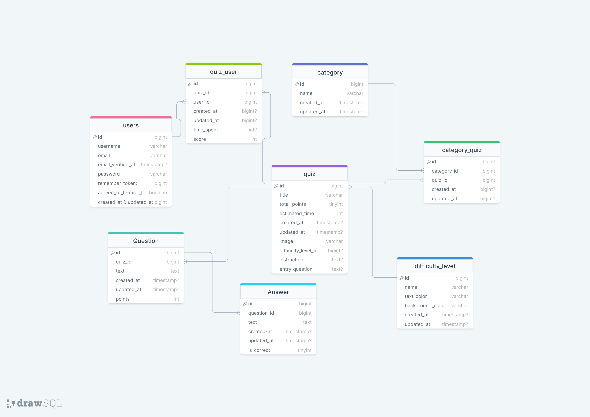

<p align="center"><a href="https://laravel.com" target="_blank"></a></p>

<p align="center">
<a href="https://github.com/laravel/framework/actions"></a>
<a href="https://packagist.org/packages/laravel/framework"></a>
<a href="https://packagist.org/packages/laravel/framework"></a>
<a href="https://packagist.org/packages/laravel/framework"></a>
</p>

## Overview

```
<p>
The back-end of Quiz Wiz serves as the core logic handler, interfacing with the front-end to process requests and deliver the appropriate responses. It handles user authorizations, quiz data retrieval, quiz attempts, and filters data based on user queries. Built with Laravel and MySQL, it manages intricate data relationships and ensures robust data delivery to support a seamless quiz-taking experience.</p>
```

# Technologies Used

```
<ul>
<li>Laravel: A PHP framework for web and API development, chosen for its elegance and simplicity.</li>
<li>MySQL: Used for data storage, providing a reliable and scalable database solution.
</li>
</ul>
```

# Prerequisites

```
<ul>
<li>PHP version 8.0 or higher.</li>
<li>MySQL version 8.0 or higher.</li>
<li>Composer for managing PHP dependencies.</li>
<li>Laravel 11.</li>
</ul>
```

## Getting Started

1. First of all you need to clone Task Manager repository from github:

```
 git clone git@github.com:RedberryInternship/api-quizwiz-irakli-ketchekmadze.git
```

2. Next step requires you to run composer install in order to install all the dependencies.

```
   composer install
```

3. Now we need to set our env file. Go to the root of your project and execute this command.

```
 cp .env.example .env
```

And now you should provide .env file all the necessary environment variables:

MYSQL:

DB_CONNECTION=mysql

DB_HOST=127.0.0.1

DB_PORT=3306

DB_DATABASE=**\***

DB_USERNAME=**\***

DB_PASSWORD=**\***

after setting up .env file, execute:

```
php artisan config:cache
```

in order to cache environment variables.

## API endpoints

<ul>
<li>User authorization (login, registration, password reset).
</li>
<li>Filtering quizzes by categories, difficulty levels, etc.
</li>
<li>Retrieving and submitting quiz attempts for logged-in users.
</li>
</ul>

## Migrations

if you've completed getting started section, then migrating database if fairly simple process, just execute:

```
php artisan migrate
```

## Development

You can run Laravel's built-in development server by executing:

```
php artisan serve
```

## Project Structure

```
├─── app
│ ├─── Console
│ ├─── Exceptions
│ ├─── Http
│ ├─── Providers
│ │... Models
├─── bootstrap
├─── config
├─── database
├─── lang
├─── public
├─── resources
├─── routes
├─── storage
├─── tests
```

-   .env
-   .env.example
-   artisan
-   composer.json
-   package.json
-   phpunit.xml
-   .php-cs-fixer.php

For more information about project standards, take a look at these docs:

<a href="https://laravel.com/docs/11.x">Laravel</a>

## Database

<a href="https://drawsql.app/teams/irakli/diagrams/quiz-wiz">Link to DrawSQL</a>



## License

The Laravel framework is open-sourced software licensed under the [MIT license](https://opensource.org/licenses/MIT).

# api-quizwiz-irakli-ketchekmadze
